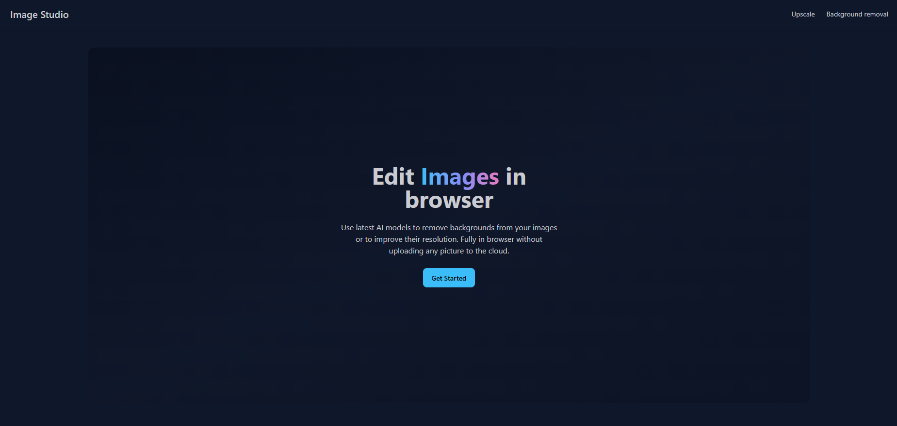
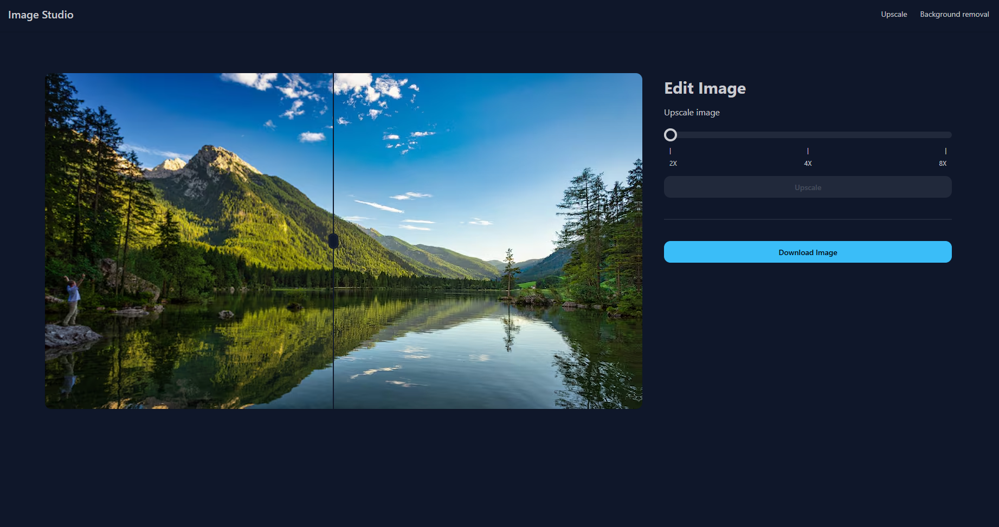
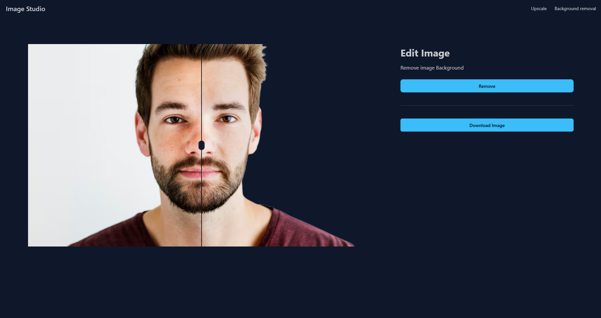

# Image studio

This project uses AI to upscale and background removal 










## About this project

This project uses:
- [React](https://react.dev/) for the frontend
- [transformers.js](https://huggingface.co/docs/transformers.js/index) for AI models

Models used:
- [swin2SR-lightweight-x2-64](https://huggingface.co/Xenova/swin2SR-lightweight-x2-64) For upscaling
- [briaai/RMBG-1.4](https://huggingface.co/briaai/RMBG-1.4) For background-removal

## Running this project 

You can access it on github pages at: [Image studio](https://mo7medehab.github.io/img-studio/)

or

Run it locally by cloning this repository:
```
git clone https://github.com/mo7medehab/img-studio.git
```

Then go to the file location and run npm:
```
npm run dev
```
